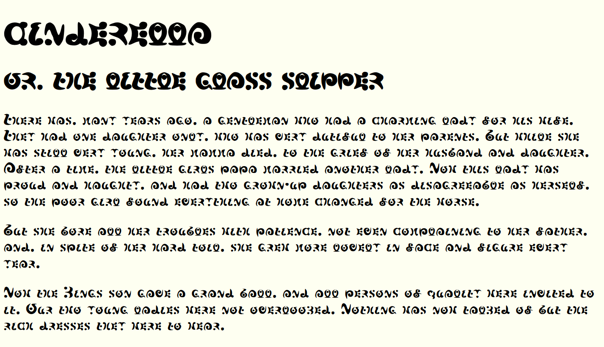

# 魔法文字フォント

「魔法つかいプリキュア!」劇中に登場する魔法文字の模倣フォント

## 概要

グリフは公式設定で存在しているものだけ収録しています。
魔法文字には大小字体の区別が存在しない（大文字のみが使用されている）ため、小英字は大文字のグリフの縮小流用になっています。

| 項目 | 値 |
|-|-|
| 種類 | OpenType |
| ファミリー名 | Maho Moji |
| スタイル | Regular |
| 収録グリフ | A-Za-z0-9,.?!()- |
| 色付きグリフ | なし |
| カーニングペア | 設定なし |

## 参考文献

- 魔法つかいプリキュア! オフィシャルコンプリートブック - 学研プラス (ISBN: 978-4056111798)

## ライセンス

[ここを参照](LICENSE)
